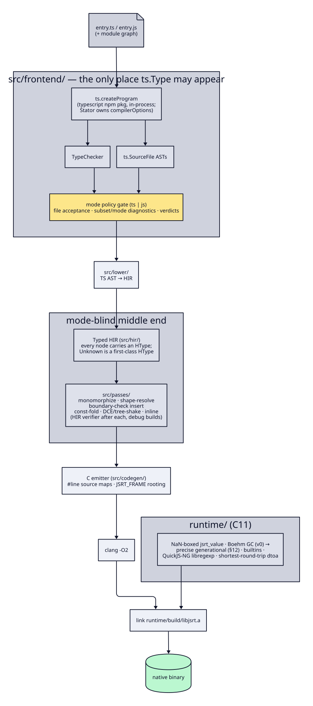
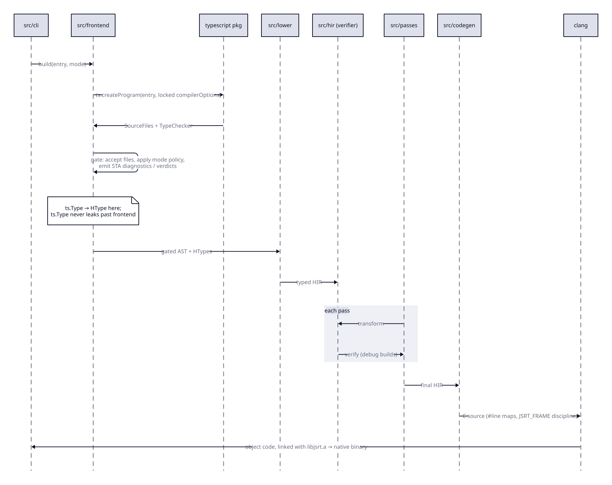
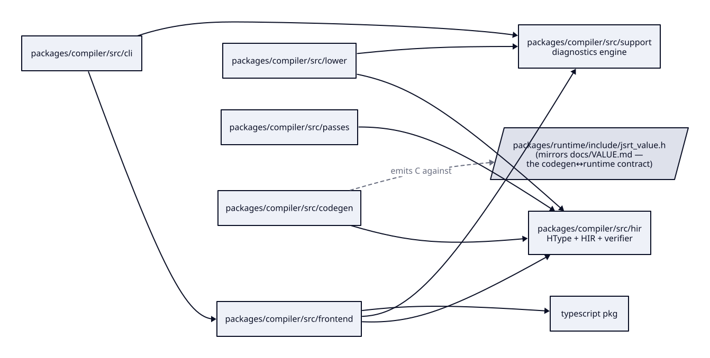
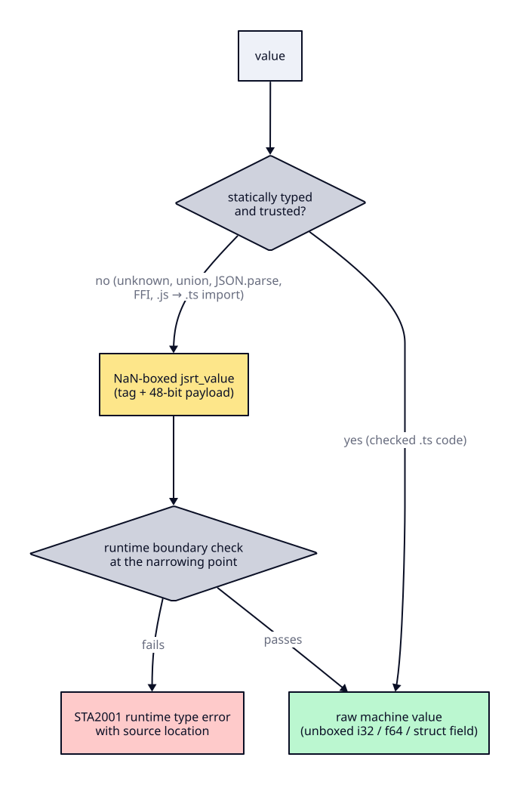

# ARCHITECTURE.md — how Stator works (diagrams)

UML-style views of the pipeline defined in `plan.md` §2. That section is the authority; these
diagrams visualize it and may not contradict it.

Diagram **source** is D2 in [`architecture/`](architecture/) (not Mermaid). The SVGs next to the
`.d2` files are the GitHub-visible render. After editing a `.d2` file, regenerate:

```
d2 --layout=elk docs/architecture/pipeline.d2 docs/architecture/pipeline.svg
d2 docs/architecture/build.d2 docs/architecture/build.svg
d2 --layout=elk docs/architecture/packages.d2 docs/architecture/packages.svg
d2 docs/architecture/values.d2 docs/architecture/values.svg
```

`d2` is a docs tool (`brew install d2`), not part of `pnpm run ci`.

## 1. Compile pipeline (component view)

One pipeline, two modes. Mode is a policy layer at the frontend gate; nothing below it knows the
mode existed (plan §0.8).



Source: [`architecture/pipeline.d2`](architecture/pipeline.d2)

## 2. A `stator build` invocation (sequence view)



Source: [`architecture/build.d2`](architecture/build.d2)

Diagnostics short-circuit: any `STA` error at the gate stops the build with code + span + mode;
`stator explain` runs the same front half and reports per-construct verdicts
(`static | dynamic | error | not-yet`) instead of continuing to codegen.

## 3. Module dependencies (package view)

Arrows mean "imports from". The two structural invariants are the point of this diagram.



Source: [`architecture/packages.d2`](architecture/packages.d2)

Invariants:
- **`ts.Type` stops at `src/frontend/`** — everything downstream speaks HType only.
- **Mode stops at the gate** — a pass or the emitter needing the mode means the design is wrong (plan §0.8).
- Generated C touches values only through `jsrt_value.h` accessors; every generated function opens
  `JSRT_FRAME(n)` and pops it on every exit path, including landing pads.

## 4. Value flow at a type boundary (activity view)

Why typed code is fast and untyped code still works (plan §1, §2):



Source: [`architecture/values.d2`](architecture/values.d2)
