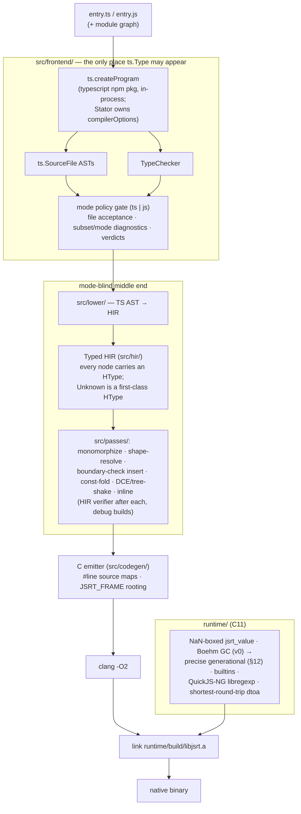
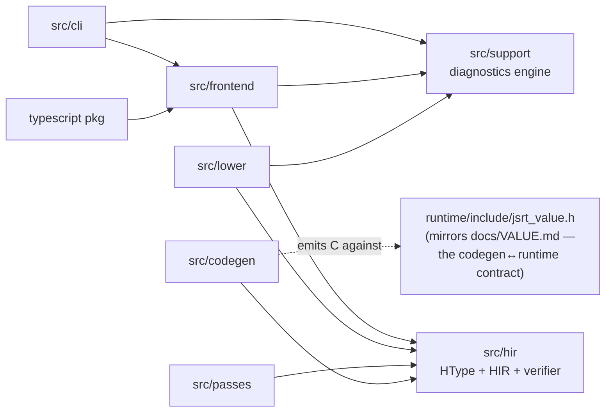
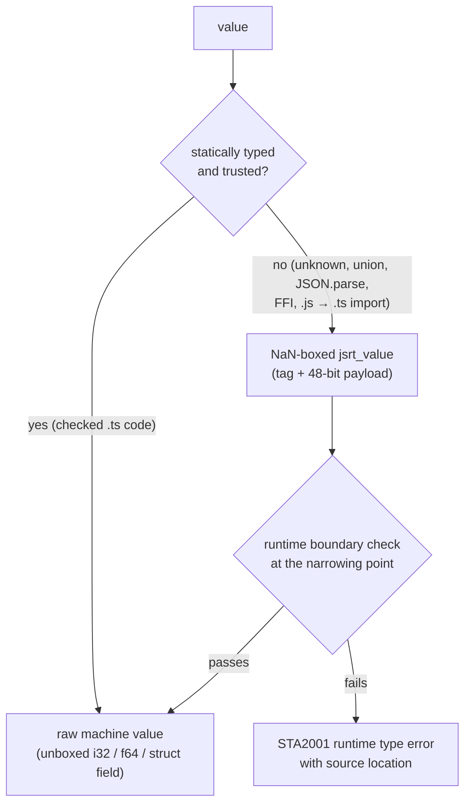

# ARCHITECTURE.md — how Stator works (diagrams)

UML-style views of the pipeline defined in `plan.md` §2. That section is the authority; these
diagrams visualize it and may not contradict it. Mermaid renders natively on GitHub — no tooling.

## 1. Compile pipeline (component view)

One pipeline, two modes. Mode is a policy layer at the frontend gate; nothing below it knows the
mode existed (plan §0.8).



## 2. A `stator build` invocation (sequence view)

```mermaid
sequenceDiagram
    participant CLI as src/cli
    participant FE as src/frontend
    participant TS as typescript pkg
    participant LO as src/lower
    participant HIR as src/hir (verifier)
    participant PA as src/passes
    participant CG as src/codegen
    participant CC as clang

    CLI->>FE: build(entry, mode)
    FE->>TS: ts.createProgram(entry, locked compilerOptions)
    TS-->>FE: SourceFiles + TypeChecker
    FE->>FE: gate: accept files, apply mode policy,<br/>emit STA diagnostics / verdicts
    Note over FE: ts.Type → HType here; ts.Type never leaks past frontend
    FE->>LO: gated AST + HTypes
    LO->>HIR: typed HIR
    loop each pass
        PA->>HIR: transform
        HIR-->>PA: verify (debug builds)
    end
    PA->>CG: final HIR
    CG->>CC: C source (#line maps, JSRT_FRAME discipline)
    CC-->>CLI: object code, linked with libjsrt.a → native binary
```

Diagnostics short-circuit: any `STA` error at the gate stops the build with code + span + mode;
`stator explain` runs the same front half and reports per-construct verdicts
(`static | dynamic | error | not-yet`) instead of continuing to codegen.

## 3. Module dependencies (package view)

Arrows mean "imports from". The two structural invariants are the point of this diagram.



Invariants:
- **`ts.Type` stops at `src/frontend/`** — everything downstream speaks HType only.
- **Mode stops at the gate** — a pass or the emitter needing the mode means the design is wrong (plan §0.8).
- Generated C touches values only through `jsrt_value.h` accessors; every generated function opens
  `JSRT_FRAME(n)` and pops it on every exit path, including landing pads.

## 4. Value flow at a type boundary (activity view)

Why typed code is fast and untyped code still works (plan §1, §2):


